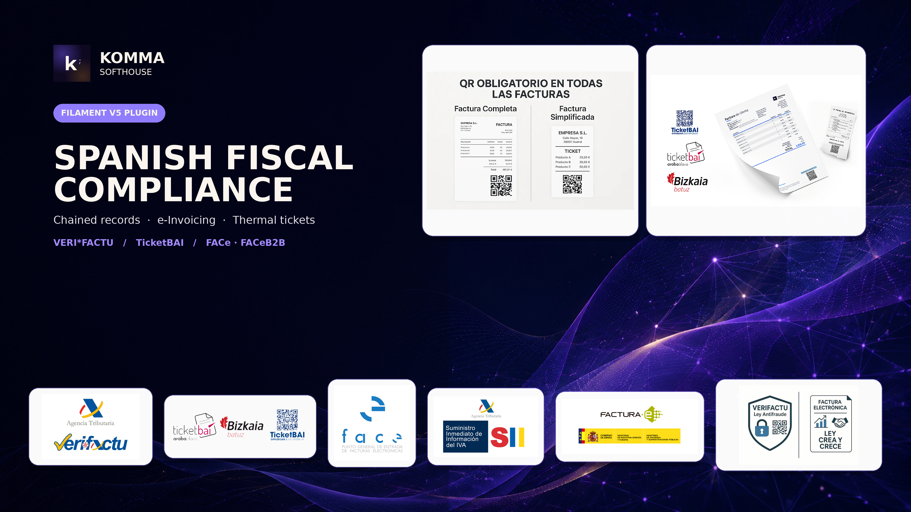

# Filament Verifactu Documentation

<p align="center">
    
</p>

Official documentation for
[Filament Verifactu](https://github.com/komma-softhouse/filament-verifactu),
a Filament v5 fiscal compliance engine for VERI*FACTU, TicketBAI,
FACe and FACeB2B.

<p>
    <a href="https://github.com/komma-softhouse/filament-verifactu">
        Plugin repository
    </a>
    ·
    <a href="https://packagist.org/packages/komma-softhouse/filament-verifactu">
        Packagist
    </a>
</p>

VERI\*FACTU / RRSIF and TicketBAI compliant fiscal engine for
[Filament](https://filamentphp.com) 5.x: chained fiscal records, AEAT and
foral (Araba/Bizkaia/Gipuzkoa) submission, XAdES signing, a full document
lifecycle, FACe/FACeB2B electronic invoicing, and fiscal reporting drafts —
for Spanish businesses that need their invoicing to comply with Real
Decreto 1007/2023, Orden HAC/1177/2024 and (for the three Basque
territories) their own TicketBAI regulation.

[](https://packagist.org/packages/komma-softhouse/filament-verifactu)
[](https://github.com/komma-softhouse/filament-verifactu/actions/workflows/tests.yml)
[](https://packagist.org/packages/komma-softhouse/filament-verifactu)

## What this plugin does

- **Chains and hashes fiscal records** exactly as RRSIF requires, with a
  single gate (`RecordService`) that locks the issuer, links the new record
  to the previous hash, validates it against the AEAT engine, and persists
  it — impossible to fork, impossible to edit afterwards.
- **Submits to the AEAT** in both remission modes: continuous (VERI\*FACTU)
  and on-demand (signed XML batches, answering a requirement or opened as a
  voluntary remission), respecting the AEAT's flow-control window.
- **Submits to TicketBAI** (Araba, Bizkaia, Gipuzkoa) through the exact same
  `RecordService` gate — a completely separate engine under the hood, with
  its own signature-value chaining, registration, cancellation, corrective
  (rectificativa) invoices, and Zuzendu subsanación (Araba/Gipuzkoa; Bizkaia
  does not implement it). Bizkaia submissions are automatically wrapped in
  the correct Batuz/LROE envelope (Modelo 140 autónomo or 240 sociedad).
- **Signs with XAdES-BES** when an AEAT issuer operates in non-Verifactu
  mode (VERI\*FACTU systems are exempt from signing per art. 16.3 — hash
  only); TicketBAI records are always signed, per its own regulation.
- **Runs the whole document lifecycle**: quotes → orders → delivery notes →
  proformas → invoices/tickets, a forward-only conversion graph (including
  merging several delivery notes into one invoice), credit notes with
  per-line returns, per-line and general discounts, IRPF withholding,
  hospitality pre-bills and kitchen routing, and SAT repair orders (with a
  customer-facing tracking QR) that fiscalize on delivery.
- **Prints**: A4 with automatic draft/copy watermarking, and 14 kinds of
  ESC/POS thermal ticket — including a paired **Print Agent** add-on
  (Windows service installer generated from the panel) for hosts that can't
  talk to a receipt printer directly from the browser.
- **Sends to FACe** (public-sector electronic invoicing) and **FACeB2B**
  (Ley 25/2013's separate, already-active extension to large private
  subcontractors of public administrations — full lifecycle, both as sender
  and as receiver: send, cancel, download, reject, mark as paid, resolve
  cancellations, validate signatures), and offers OCR-assisted drafting
  from a photo via [Laravel AI](https://laravel.com/docs/13.x/ai-sdk) — the
  host picks any provider they already hold a key for, never locked to one.
- **Exposes an on-prem API sidecar** so external ERPs/POS terminals can
  register records and fetch a QR synchronously, authenticated per issuer,
  with signed webhooks on every accepted/rejected submission.
- **Drafts Modelos 303, 347, 349 (real E/S classification from each
  record's own data), 111 and 115** for the accountant, each exportable
  as CSV.

Every surface beyond the core fiscal resources ships **disabled by
default** — a host that registers only the plugin object gets the fiscal
chain and nothing else; every other module is a fluent opt-in.

## Requirements

- PHP >= 8.4
- Laravel >= 13.0
- Filament >= 5.0

## Installation

```bash
composer require komma-softhouse/filament-verifactu
php artisan migrate
```

Register the plugin on your panel provider:

```php
use Komma\Verifactu\VerifactuPlugin;

public function panel(Panel $panel): Panel
{
    return $panel
        ->plugin(
            VerifactuPlugin::make()
                ->documents()
                ->repairs()
                ->gotenbergPdf('http://gotenberg:8')
                ->escPos()
                ->face()
                //->einvoincing() See Configuration below for details.
                ->ocr()
                ->api(),
        );
}
```

Publish and fill in the config:

```bash
php artisan vendor:publish --tag="filament-verifactu-config"
```

At minimum, set the `ComputerSystem` (implementer identity) variables before
the first submission — see [Configuration](#configuration).

## Configuration

| Toggle | What it enables |
| --- | --- |
| `->documents()` | Document, series-format and template resources, the document lifecycle |
| `->repairs()` | SAT repair order resource |
| `->gotenbergPdf($url)` | A4 PDF rendering via a Gotenberg instance |
| `->escPos()` | Thermal ticket printing |
| `->printAgent()` | Print agent pairing page and installer generation |
| `->einvoincing()` | Pending BOE publication of the Orden Ministerial (Ley Crea y Crece / RD 238/2026) |
| `->face()` | FACe: the "Send to FACe" action, history, settings and generate pages |
| `->faceb2b()` | FACeB2B: the "Send to FACeB2B" action and cancellation requests |
| `->ocr()` | The "Create from photo" OCR-assisted draft action and its settings page |
| `->api()` | *(informational — see below)* |

The core fiscal resources (Issuers, Fiscal records, Submissions, System
events, Audit trail) and the five report pages are always registered.

The **API sidecar** is activated independently, via config/env
(`VERIFACTU_API=true`), not through the fluent `->api()` call: it is meant
for LAN-local ERPs and POS terminals that never load a Filament panel, so it
cannot depend on a toggle that only resolves once a panel does.

See the published `config/filament-verifactu.php` for every environment
variable (implementer identity, certificate storage, FACe seller address,
OCR provider key, queue name, batch size).

## Usage

```php
use Komma\Verifactu\Facades\Verifactu;
use Komma\Verifactu\Enums\FiscalRegime;
use Komma\Verifactu\Models\Issuer;
use Komma\Verifactu\Models\FiscalDocument;

$issuer = Issuer::create(['name' => 'My Company SL', 'nif' => 'B12345678']);
$issuer->activateFiscal(FiscalRegime::Aeat); // sealed, irreversible

$document = FiscalDocument::create([
    'issuer_id' => $issuer->id,
    'type' => DocumentType::Ticket,
    'status' => DocumentStatus::Draft,
]);
$document->lines()->create(['description' => 'Coffee', 'quantity' => 1, 'unit_price' => '1.50', 'tax_rate' => '10.00']);

Verifactu::completeDocument($document); // numbers, freezes, chains the fiscal record
Verifactu::submitPending($issuer);
Verifactu::verifyChain($issuer);
```

Hosts with their own invoicing model can skip the document layer entirely
and call the fiscal engine directly:

```php
Verifactu::register($issuer, $invoiceData);   // InvoiceData DTO
Verifactu::cancel($issuer, $cancellationData);
```

## Minimal integration: bolting compliance onto existing host software

This is the scenario for a third-party developer who installs this plugin
into a shop or bar's **existing** POS/ERP — one that has no VERI\*FACTU or
TicketBAI compliance at all — and only needs two things: **register the
sale** and **get its QR**. None of `->documents()`, `->repairs()`,
`->escPos()`, FACe or OCR are required for this — only the core fiscal
resources, which are always registered.

### 1. One-time setup per issuer (regime picked once, sealed forever)

```php
use Komma\Verifactu\Enums\FiscalRegime;
use Komma\Verifactu\Enums\FiscalMode;
use Komma\Verifactu\Models\Issuer;

$issuer = Issuer::create(['name' => 'Bar Rosalía SL', 'nif' => 'B12345678']);

// AEAT / common territory:
$issuer->activateFiscal(FiscalRegime::Aeat, FiscalMode::NonVerifactu);

// Araba, Bizkaia or Gipuzkoa (TicketBAI) instead — VERI*FACTU mode does
// not exist there, only NonVerifactu is valid:
// $issuer->activateFiscal(FiscalRegime::Araba, FiscalMode::NonVerifactu);
// $issuer->update(['tbai_license' => 'the software-guarantor license the foral treasury issued you']);
```

Upload the issuer's certificate once (`CertificateService::store()`, or the
"Upload certificate" action on `VerifactuSettingsPage` if the host software
does load this plugin's own Filament panel for that one screen). The
service itself has no Filament dependency at all:

```php
use Komma\Verifactu\Enums\CertificateHolderType;
use Komma\Verifactu\Services\CertificateService;

app(CertificateService::class)->store(
    $issuer,
    file_get_contents('/path/to/certificate.p12'),
    'the certificate passphrase',
    CertificateHolderType::Obligado, // or Representative / SocialCollaborator
);
```

### 2. Per sale: register, then print/display the QR

```php
use Komma\Verifactu\Facades\Verifactu;
use Komma\Verifactu\Data\{InvoiceData, BreakdownData, RecipientData};

$record = Verifactu::register($issuer, new InvoiceData(
    invoiceNumber: 'T2026-0001',       // the host's own series+number
    issuedOn: new DateTimeImmutable(),
    invoiceType: 'F2',                 // F2: simplified (ticket) — the common POS case
    description: 'Coffee and toast',
    breakdown: [
        new BreakdownData(
            taxType: '01', regimeType: '01', operationType: 'S1',
            baseAmount: '4.50', taxRate: '10.00', taxAmount: '0.45',
        ),
    ],
    totalTaxAmount: '0.45',
    totalAmount: '4.95',
));

// Same call for BOTH regimes — RecordService routes to AEAT or TicketBAI
// internally from $issuer->regime. Only difference: a named recipient on
// a TicketBAI issuer needs postalCode/address (AEAT/VERI*FACTU do not):
// recipients: [new RecipientData('Customer SL', 'B87654321', postalCode: '01001', address: 'Calle Mayor 1')]

$qrSvg = Verifactu::qrSvg($record);       // print/display straight away
$qrUrl = Verifactu::qrUrl($record);       // or just the URL, to build your own QR
```

**This is not the whole picture for an AEAT issuer.** `register()` only
chains and hashes the record locally (and, in non-Verifactu mode, signs it
XAdES) — it does **not** submit to the AEAT by itself, in either
remission mode. Something has to actually send the queue:

```php
Verifactu::submitPending($issuer); // call this periodically
```

Run it from a scheduled command (`php artisan verifactu:send-pending`,
scheduled every few minutes for VERI\*FACTU's continuous cadence, or
on-demand for non-Verifactu when answering a requirement/opening a
voluntary remission). Skip this only for a **TicketBAI** issuer —
`register()` there is fully synchronous end-to-end, nothing else to run.

That is the entire integration surface: two calls (three if AEAT, for the
submission cron), no Filament UI required on the host's side at all
(though `php artisan migrate` still needs to have run, and the host
process needs the certificate on disk/its configured disk, and — for AEAT
— a queue worker running).

### 3. Or integrate from outside PHP entirely: the on-prem API sidecar

For host software that isn't Laravel (or isn't PHP) at all, the same two
steps go over HTTP instead — enable it with `VERIFACTU_API=true` and
generate a bearer key per issuer from `VerifactuSettingsPage`.

The same operational note from step 2 applies here too, just moved to the
*server* side: for an AEAT issuer, whatever Laravel app is actually
running this plugin (even if it only ever receives calls from the API,
never loads its panel for anything else) still needs
`php artisan verifactu:send-pending` scheduled — the client calling the
API is never responsible for that, only for calling `store()`/`cancel()`.

```
POST /api/verifactu/records
Authorization: Bearer vf_...
Content-Type: application/json

{
  "invoice_number": "T2026-0001",
  "issued_on": "2026-08-27",
  "invoice_type": "F2",
  "description": "Coffee and toast",
  "total_tax_amount": "0.45",
  "total_amount": "4.95",
  "breakdown": [
    {"tax_type": "01", "regime_type": "01", "operation_type": "S1", "base_amount": "4.50", "tax_rate": "10.00", "tax_amount": "0.45"}
  ],
  "recipients": [
    {"name": "Customer SL", "nif": "B87654321", "postal_code": "01001", "address": "Calle Mayor 1"}
  ]
}
```

`recipients` (and its `postal_code`/`address`, required only for a
TicketBAI issuer) is optional and omittable for a plain ticket with no
named buyer. The response includes the QR URL directly. To check whether
an AEAT submission actually resolved (without setting up a webhook
receiver — see below for that), poll the same id later:

```
GET /api/verifactu/records/{id}
Authorization: Bearer vf_...
```

```json
{"id": 1, "status": "accepted", "error_code": null, "error_message": null, "qr_url": "https://..."}
```

```
GET /api/verifactu/records/{id}/qr
Authorization: Bearer vf_...
```

For a TicketBAI issuer specifically, correcting an already-registered
invoice's data (Zuzendu — Araba/Gipuzkoa only, Bizkaia does not implement
it) goes through its own endpoint rather than a new corrective invoice:

```
POST /api/verifactu/records/correct
Authorization: Bearer vf_...
Content-Type: application/json

{
  "original_invoice_number": "T2026-0001",
  "invoice_number": "T2026-0001",
  "issued_on": "2026-08-27",
  "invoice_type": "F2",
  "description": "Corrected description or amounts",
  "total_tax_amount": "0.45",
  "total_amount": "4.95",
  "breakdown": [
    {"tax_type": "01", "regime_type": "01", "operation_type": "S1", "base_amount": "4.50", "tax_rate": "10.00", "tax_amount": "0.45"}
  ]
}
```

Corrective (rectificativa/abono) invoices — a return or a billing error,
the single most common thing a shop or bar needs beyond a plain sale — go
through the exact same endpoint: set `invoice_type` to `R1`-`R5`,
`corrective_type` to `S` (substitution) or `I` (differences, the common
case for a partial return), and `corrected_invoices` to the original
sale's `invoice_number`/`issued_on`:

```json
{
  "invoice_number": "T2026-0002",
  "issued_on": "2026-08-27",
  "invoice_type": "R1",
  "description": "Return: cold coffee",
  "corrective_type": "I",
  "corrected_invoices": [{"invoice_number": "T2026-0001", "issued_on": "2026-08-27"}],
  "total_tax_amount": "-0.45",
  "total_amount": "-4.95",
  "breakdown": [
    {"tax_type": "01", "regime_type": "01", "operation_type": "S1", "base_amount": "-4.50", "tax_rate": "10.00", "tax_amount": "-0.45"}
  ]
}
```

Bearer keys are generated per issuer from `VerifactuSettingsPage` in the
panel.

A host that built its own `FiscalDocument` (again, plain Eloquent — create
the `FiscalDocument`/`DocumentLine` rows and call
`app(Komma\Verifactu\Documents\Services\DocumentGate::class)->complete($document)`
directly, no Filament UI required) can send it to FACe or FACeB2B the same
way:

```
POST /api/verifactu/face/send        (FACe — needs dir3_code + recipient_email)
POST /api/verifactu/faceb2b/send     (FACeB2B — routes by buyer_nif, no DIR3)
Authorization: Bearer vf_...
Content-Type: application/json

{
  "document_id": 42,
  "seller_address": "Av. Rosalía de Castro 24", "seller_post_code": "15960", "seller_town": "Ribeira", "seller_province": "A Coruña",
  "buyer_name": "Concello de Ribeira", "buyer_nif": "P1507400H",
  "recipient_email": "notificaciones@ribeira.gal", "dir3_code": "L01150737"
}
```

### 4. Getting notified without polling: webhooks (AEAT only)

For an **AEAT** issuer specifically, submission is asynchronous — `store()`
only chains and queues the record; the actual accept/reject verdict
arrives later, when `verifactu:send-pending` runs. Set `webhook_url` (and
optionally `webhook_secret`) on the `Issuer` — from `IssuerForm` in the
panel, or `$issuer->update(['webhook_url' => ..., 'webhook_secret' => ...])`
directly — and this plugin `POST`s the verdict there itself instead of
making the host poll:

```json
{
  "event": "submission.accepted",
  "issuer_nif": "B12345678",
  "submission_id": 42,
  "status": "accepted",
  "csv": "...",
  "records_count": 3,
  "error": null,
  "occurred_at": "2026-08-27T10:00:00+00:00"
}
```

If `webhook_secret` is set, the body is signed with HMAC-SHA256 in the
`X-Verifactu-Signature` header — verify it before trusting the payload.

**TicketBAI has no webhook of its own, and does not need one**: unlike
AEAT, `register()`/`correctTbaiInvoice()` there are fully synchronous —
the accepted/rejected verdict is already in the same response `store()`
gives back, so there is nothing later to be notified about.

## Notifying customers on repair status changes

Every transition on a repair order (`RepairService::transition()`,
including the initial "received" and the final "delivered") fires
`Komma\Verifactu\Documents\Events\RepairStatusChanged` — listen for it to
send an SMS/email/WhatsApp yourself; this plugin only builds the tracking
page behind each order's own QR (`RepairOrder::tracking_token`), it never
sends anything on its own:

```php
use Komma\Verifactu\Documents\Events\RepairStatusChanged;

Event::listen(function (RepairStatusChanged $event) {
    // $event->repairOrder, $event->from, $event->to (both RepairStatus enums)
    $phone = $event->repairOrder->customer['phone'] ?? null; // 'customer' is a plain JSON column — whatever shape the host stored
    if ($phone) {
        Notification::route('vonage', $phone)->notify(new RepairUpdated($event->repairOrder));
    }
});
```

## Roadmap

**B2B electronic invoicing** (Ley 18/2022 "Crea y Crece", RD 238/2026): the
Reglamento is already published (BOE, 31 March 2026) and mandates EN 16931 /
UBL for structured B2B invoices, but the Orden Ministerial fixing the
technical detail of Hacienda's public solution is still pending its
definitive BOE publication (public consultation closed 8 May 2026, in force
expected 1 October 2026 — the date that starts the 12/24-month countdown to
mandatory adoption in October 2027, >€8M turnover, and October 2028 for
everyone else). `->einvoicing()` will ship once that Order is published and
its technical annex is stable enough to build against. This is unrelated to
FACeB2B (Ley 25/2013), already fully supported today.

**FACeB2B received-invoices inbox**: sending, cancelling and status-checking
are built and wired into the panel; the full receiver-side lifecycle
(download, reject, mark as paid, resolve a sender's cancellation, validate
signatures) is implemented at the service/facade layer but has no dedicated
panel screen yet for browsing invoices this issuer has received.

## Scope

TicketBAI's Zuzendu (subsanación) is not implemented for Bizkaia — its own
`Endpoint` class rejects it outright; that territory's corrections go
through Batuz/LROE's own modification operations instead, which this
package does not build. TicketBAI's breakdown only covers goods/services
sold nationally or abroad as classified by each line's own AEAT-style
operation code (S1/S2/E1-E6/N1-N2) — foreign lines default to the "service"
category absent a line-level goods/services signal in `BreakdownData`, the
same honest limitation Modelo 349's classification already documents.
Modelo 111 and 115 are manual entry calculators: this plugin fiscalizes
sales and has no visibility into payroll or rent payments the business
makes.

## Architecture and add-on pricing

See [ARCHITECTURE.md](ARCHITECTURE.md) for how the plugin is built
internally (the single-gate/two-engines design) and — the part that
matters for selling this — exactly which toggles map to which add-ons,
and what pricing was actually settled on versus what's still an open
decision.

## Testing

```bash
composer test
```

Run the local homologation battery against a disposable sandbox issuer
before going live:

```bash
php artisan verifactu:homologate                    # AEAT
php artisan verifactu:homologate --submit           # also attempts a real AEAT sandbox round-trip, if a certificate is present
php artisan verifactu:homologate-tbai                       # TicketBAI, Araba by default
php artisan verifactu:homologate-tbai --territory=bizkaia    # or --territory=gipuzkoa
```

## Changelog

Please see [CHANGELOG](CHANGELOG.md) for more information on what has
changed recently.

## Contributing

Please see [CONTRIBUTING](.github/CONTRIBUTING.md) for details.

## Security Vulnerabilities

Please review [our security policy](.github/SECURITY.md) on how to report
security vulnerabilities.

## Credits

- [Elias Olivtradet](https://github.com/edeoliv)
- [Komma SoftHouse](https://github.com/komma-softhouse)
- [All Contributors](../../contributors)

## License

This is commercial software. Please see [License File](LICENSE.md) for the
full terms.